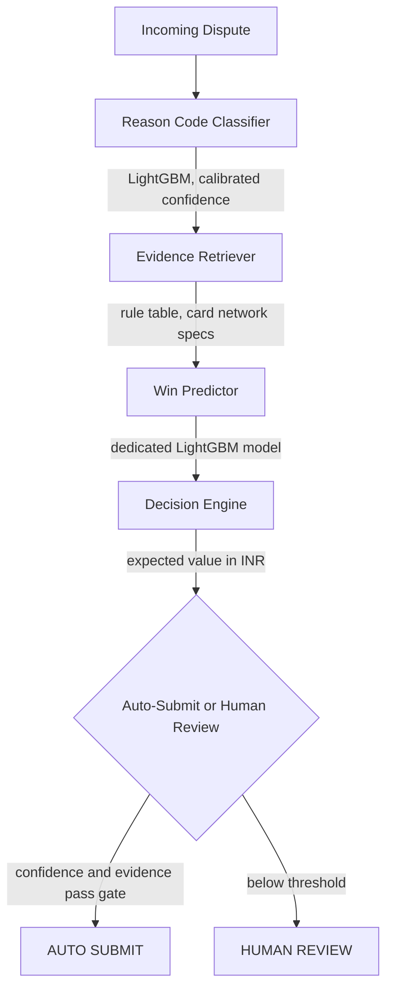

<div align="center">

#  Impulse

### Chargeback Intelligence & Auto-Resolution Platform

**Classify. Verify. Decide. Recover.**

*A defense-only, cost-aware chargeback response system built for the Razorpay AI Buildathon — Track 02: AI Risk Manager*

[]()
[]()
[]()
[]()
[]()
[]()
[]()

[Live Demo](#) · [Documentation](#-documentation-index) · [Model Cards](#-model-specifications) · [Report an Issue](../../issues)

</div>

## Live Demo

**[https://impulse-orcin.vercel.app/](https://impulse-orcin.vercel.app/)**

The platform is deployed and fully functional, run a live dispute through the Analyze a Dispute tab to see the full four stage pipeline execute in real time, classification, evidence verification, win prediction, and the cost based recommendation. Model Performance, Monitoring, and Guardrails are all live on the same deployment, no local setup required.
---

## Table of contents

- [What this is](#what-this-is)
- [Why chargebacks, why now](#why-chargebacks-why-now)
- [How it works](#how-it-works)
- [Model specifications](#-model-specifications)
- [Measured business impact](#measured-business-impact)
- [Bring your own data](#bring-your-own-data)
- [Guardrails](#guardrails)
- [What this is, and isn't](#what-this-is-and-isnt)
- [Quickstart](#quickstart)
- [Project structure](#project-structure)
- [Documentation index](#-documentation-index)
- [Testing](#testing)
- [Roadmap](#roadmap)
- [License](#license)

---

## What this is

When a customer disputes a card transaction, merchants have a narrow window to submit proof the charge was legitimate. Different reason codes require completely different evidence, and a wrong or late response means an automatic loss, even when the merchant was in the right.

**Impulse** takes an incoming dispute and, in under a second, answers four questions: what kind of dispute is this, what evidence do we actually have, how likely are we to win it, and is fighting it worth the money? Every recommendation is backed by a rupee-denominated cost calculation, not just a confidence score.

> Most chargebacks are contestable. Most are lost to slow, manual evidence assembly, not because the merchant was wrong. Impulse automates the part that's actually solvable, and stays honest about the part that isn't.

---

## Why chargebacks, why now

- Card networks maintain 30+ distinct reason codes, each requiring a different evidence template, under a hard 7 to 30 day response deadline.
- Published industry figures put friendly fraud, legitimate customers disputing valid charges, at roughly 79% of all chargebacks, meaning most disputes are genuinely winnable if the right evidence is assembled in time.
- The bottleneck isn't fraud detection. It's evidence assembly speed and correctness, a solvable engineering problem, not an unsolvable trust problem.
- Razorpay's own chargeback documentation names submitting the wrong document type against the wrong reason code as the leading cause of preventable dispute losses.

---

## How it works



Two separate machine learning models are used deliberately, not one combined model. What is this dispute and will we win it are different questions, and conflating them would make both harder to calibrate and debug independently.

| Stage | Component | Type |
|---|---|---|
| 1 | Reason Code Classifier | LightGBM, multi-class, Platt-calibrated |
| 2 | Evidence Retriever | Deterministic rule table (not learned, see below) |
| 3 | Win Predictor | LightGBM, binary, separately calibrated |
| 4 | Decision Engine | Expected value calculation in rupees, not a bare threshold |

#### Why evidence matching is rule-based, not learned

Card network evidence requirements are fixed, published specifications, not a pattern to be inferred. A rule table here is fully auditable, anyone can see exactly why a decision was made. The ML budget is spent instead on the two questions that genuinely require it: classification and win prediction.

---

##  Model Specifications

### Reason Code Classifier

| | |
|---|---|
| **Task** | Multi-class classification across 10 dispute reason codes (Visa 10.4/10.5/13.1/13.3/13.6, Mastercard 4837/4853/4855/4860/4863) |
| **Algorithm** | LightGBM plus `CalibratedClassifierCV` (Platt scaling, 3-fold CV) |
| **Hyperparameters** | `n_estimators=300, learning_rate=0.05, max_depth=6, num_leaves=31, subsample=0.8, colsample_bytree=0.8, class_weight="balanced"` |
| **Training data** | 5,000 synthetic disputes: 3,500 train / 750 validation / 750 held-out test |
| **Accuracy (held-out test)** | 98.4% (95% bootstrap CI: 97.5% to 99.2%) |
| **Macro F1** | 98.49% |
| **Fallback behavior** | Explicit `model_status` flag on load or inference failure; decision engine structurally blocks auto-submit when this flag is set |

<details>
<summary><strong>Per-class breakdown</strong> (click to expand)</summary>

| Reason Code | Precision | Recall | F1 | Support |
|---|---|---|---|---|
| 10.4, Fraud Card Absent | 100.0% | 100.0% | 100.0% | 103 |
| 10.5, Fraud Counterfeit | 100.0% | 100.0% | 100.0% | 28 |
| 13.1, Merchandise Not Received | 98.31% | 100.0% | 99.15% | 116 |
| 13.3, Not as Described | 100.0% | 97.14% | 98.55% | 70 |
| 13.6, Credit Not Processed | 100.0% | 100.0% | 100.0% | 45 |
| 4837, No Cardholder Authorization | 92.78% | 98.90% | 95.74% | 91 |
| 4853, Cardholder Dispute Defective | 100.0% | 98.91% | 99.45% | 92 |
| 4855, Goods or Services Not Provided | 97.06% | 100.0% | 98.51% | 66 |
| 4860, Credit Not Processed MC | 100.0% | 98.48% | 99.24% | 66 |
| 4863, Cardholder Does Not Recognize | 98.51% | 90.41% | 94.29% | 73 |

Weakest class: 4863 (recall 90.41%), most often confused with 4837since both are unauthorized-transaction claims with overlapping evidence signatures.

Fairness audit (accuracy by product category, checking for hidden blind spots): ranges from 91.18% (Sports, n=34) to 100% (Electronics, Home, Health). Weakest segment overall: the highest transaction-amount decile (94.67%), flagged as worth monitoring in production, not hidden.
</details>

### Win Predictor

| | |
|---|---|
| **Task** | Binary classification: probability the merchant wins if the dispute is fought |
| **Algorithm** | LightGBM plus `CalibratedClassifierCV` (Platt scaling, 3-fold CV) |
| **Hyperparameters** | `n_estimators=200, learning_rate=0.05, max_depth=5, num_leaves=31, subsample=0.8, colsample_bytree=0.8` |
| **AUC (dedicated model, held-out test)** | 0.7537 |
| **Fallback behavior** | Returns exactly 0.5 (unknown) on any failure, never fabricates a confident-looking score |

Note on the two AUC numbers referenced in the docs: an earlier, simpler evidence-strength heuristic (not a trained model) scored 0.654 AUC and fell short of this project's own 0.75 target. Rather than quietly dropping that number, it's labeled "Informational / Measured" in `docs/08-evaluation.md`, and a properly dedicated model was trained and validated separately until it genuinely cleared the bar (0.7537). Reporting both, and being explicit about which one the system actually uses, was a deliberate choice.

---

## Measured business impact

On the held-out test set (n=750), at the cost-optimal decision threshold:

| Strategy | Net value |
|---|---|
| Fight every dispute (naive) | ₹5,20,200 |
| Fight no disputes (concede all) | −₹1,53,300 |
| Impulse (cost-optimal threshold) | ₹8,50,500 |

Cost assumptions (₹1,000 cost of a losing auto-fight, ₹2,250 value of a won auto-response) are working modeling assumptions used to demonstrate cost-sensitive decision-making, not cited industry data. Stated explicitly everywhere these figures appear.

---

## Bring your own data

The pipeline isn't hardwired to the bundled synthetic dataset. Upload a real transaction or dispute spreadsheet (.xlsx or .csv) and the system will:

1. Auto-suggest a column mapping to the fields it needs, editable before anything runs.
2. Report validation results honestly, exactly how many rows are usable and why any were dropped, never silently.
3. Strip every column outside the required schema before processing, proven by an automated test (`tests/test_byod.py`) that uploads a file with a PII column and asserts it never reaches the staged dataset.
4. Run in-memory only, with a session TTL. Nothing from an upload is written to permanent storage.

Uploading real data proves the pipeline generalizes beyond the sample set. It does not, on its own, prove the model's accuracy holds on that data, that requires a labeled test set of real outcomes, which this feature enables but doesn't fabricate.

---

## Guardrails

| Guardrail | Enforcement |
|---|---|
| Defense-only | The system can only respond to a dispute that already exists, no code path creates or simulates one |
| No PII | 100% synthetic sample data; uploaded data is stripped to an explicit allow-list and never persisted |
| Auditable evidence logic | Rule table derived from published card-network specs, not a learned black box |
| Kill switch | A single config value forces 100% human review, covered by an executable test, not just documented |
| Fails closed | Model load or inference failure routes to human review, never a confident guess |
| Full audit trail | Every decision, classification, evidence used, confidence, action taken, is logged |

Documented failure-mode behavior (ambiguous mixed-signal disputes, malformed reason codes, missing fields) lives in `docs/09-failure-modes.md` and is covered by `tests/test_failure_modes.py`.

---

## What this is, and isn't

Is: a rigorously tested prototype, validated with bootstrap confidence intervals and a fairness audit, with a tested kill switch and documented failure modes.

Isn't: a claim of production readiness. Every model result is measured on synthetic data designed to have realistic, learnable patterns, not a guarantee of equivalent performance on a real merchant's live data. Where our own numbers didn't clear our own bar, that's stated directly rather than hidden, see the win-predictor AUC note above.

---

## Quickstart

```bash
git clone https://github.com/Satvik-Shashank/Impulse.git
cd Impulse
python -m venv .venv && source .venv/bin/activate
pip install -r requirements.txt

# macOS with Apple Silicon: brew install libomp

python -m src.data.generate_disputes
python -m src.train
python -m src.evaluate --test-set data/disputes_test.csv --output results/

uvicorn api.index:app --reload
```

Then open `public/index.html`, or deploy directly, routing is defined in `vercel.json`.

Health check: `GET /api/health` reports live model status, whether LightGBM imported successfully, and whether persistence is running against a managed database or local storage.

---

## Project structure

```
Impulse/
├── api/
│   └── index.py                 FastAPI app, serverless entry point
├── src/
│   ├── data/
│   │   └── generate_disputes.py  synthetic dataset generator
│   ├── models/
│   │   ├── classifier.py         reason-code classifier
│   │   └── win_predictor.py      dedicated win-probability model
│   ├── pipeline/
│   │   ├── evidence_retriever.py rule-based evidence scoring
│   │   ├── response_generator.py representment document generation
│   │   └── run.py                end-to-end orchestration
│   ├── api/
│   │   ├── byod.py               bring-your-own-data upload and mapping
│   │   ├── monitoring.py         drift tracking, PSI calculation
│   │   └── storage.py            persistence, managed DB or local fallback
│   ├── db/
│   │   └── models.py             SQLAlchemy schema
│   ├── config.py
│   ├── train.py
│   └── evaluate.py               held-out evaluation, cost curves, fairness audit
├── public/                       frontend dashboard, vanilla HTML CSS JS
├── docs/                         13 documents, see index below
├── tests/                        34 tests across pipeline, API, BYOD, models, failure modes
└── results/                      metrics.json, monitoring baseline
```

---

##  Documentation index

| Document | Covers |
|---|---|
| `01-product-requirements.md` | Problem statement, scope, success criteria |
| `02-system-architecture.md` | Full component architecture |
| `03-api-design.md` | API contract and endpoints |
| `04-testing-strategy.md` | Test philosophy and coverage approach |
| `05-production.md` | Deployment and operational notes |
| `06-security.md` | Data handling and security posture |
| `07-performance.md` | Latency and load characteristics |
| `08-evaluation.md` | Full metrics, including the AUC honesty note above |
| `09-failure-modes.md` | Documented edge cases and expected behavior |
| `10-design-decisions.md` | Why things are built the way they are |
| `INTERVIEW-GUIDE.md` | Talking points for technical review |
| `adr/ADR-001-database-choice.md` | Architecture decision record |
| `disaster-recovery.md` | Failure recovery procedures |
| `runbook.md` | Operational runbook |

---

## Testing

```bash
pytest -q
```

34 tests across the pipeline, API layer, BYOD upload flow, both models, and documented failure modes, including tests that actively try to defeat the guardrails, for example asserting the kill switch blocks auto-submit even on a maximally strong evidence case, rather than only asserting the happy path.

---

## Roadmap

- [ ] Managed database in production (`DATABASE_URL` support already implemented in `src/api/storage.py`, pending provisioning)
- [ ] ONNX conversion for the classifier and win predictor, removing the `libgomp.so.1` system dependency on serverless runtimes
- [ ] Expanded evidence rule coverage for additional card networks
- [ ] CI-enforced consistency between `results/metrics.json` and all documentation references to those numbers

---

## License

No license file has been added to this repository yet. Until one is added, standard copyright applies, all rights reserved. Add a `LICENSE` file (MIT is a common permissive default for hackathon and portfolio projects) before treating this as open for reuse.

---

<div align="center">
<sub>Built by Satvik Shashank for the Razorpay AI Buildathon, Track 02: AI Risk Manager.</sub>
</div>
