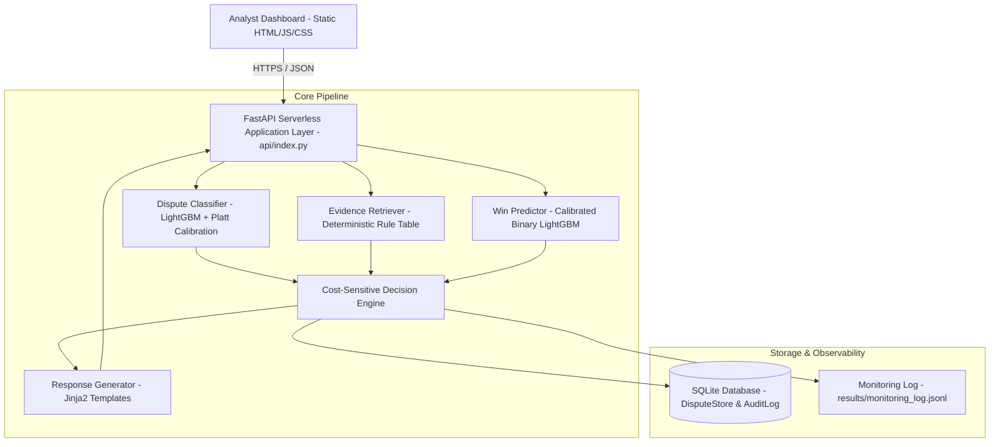

# Phase 2 — System Architecture & Data Flow

## System Overview
The Chargeback Intelligence & Auto-Resolution Platform is architected as a modular, decoupled decision-automation system. The architecture separates the client dashboard, API routing layer, machine learning inference engines, deterministic rule tables, template rendering, and persistent storage.

## Architecture Diagram

## Component Responsibilities

1. **FastAPI Application Layer (`api/index.py`)**: Handles HTTP requests, payload validation via Pydantic, and API routing tailored for Vercel Serverless Function execution.
2. **Reason-Code Classifier (`src/models/classifier.py`)**: Multi-class LightGBM model calibrated with `CalibratedClassifierCV` (sigmoid) predicting top-3 reason codes and calibrated confidence scores.
3. **Evidence Retriever (`src/pipeline/evidence_retriever.py`)**: Deterministic rule table mapping reason codes to Visa/Mastercard representment specifications, scoring available evidence strength.
4. **Win Predictor (`src/models/win_predictor.py`)**: Calibrated binary LightGBM classifier estimating $P(\text{merchant\_won})$ based on transaction signals and evidence quality.
5. **Cost-Sensitive Decision Engine (`src/pipeline/run.py`)**: Computes net expected value in INR using working cost parameters ($\text{COST\_FP} = ₹1,000$, $\text{COST\_FN} = ₹350$, $\text{SAVINGS\_TP} = ₹2,250$) and decides `AUTO_SUBMIT` vs `HUMAN_REVIEW`.
6. **Dispute Store (`src/api/storage.py`)**: Thread-safe database facade wrapping SQLAlchemy models for persistent SQLite storage (`data/chargebacks.db`).
7. **Monitoring Log (`src/api/monitoring.py`)**: Append-only JSONL logger recording predictions and computing rolling snapshot metrics for concept drift detection.

## Technology Decisions & Trade-Offs
- **FastAPI over Flask**: Native async support, automatic OpenAPI documentation generation at `/docs`, and lightweight footprint for Vercel serverless functions.
- **Vanilla HTML/CSS/JS over Heavy Frameworks**: Instant load times, zero build overhead, simple Vercel static asset hosting, avoiding Streamlit entirely as requested.
- **SQLite over PostgreSQL**: Zero-configuration embedded persistence suitable for local dev and serverless demo environments, with full SQLAlchemy migration readiness.
- **Platt-Scaled Calibration over Raw Probabilities**: Ensures LightGBM raw scores accurately map to true empirical probabilities required for cost-threshold decision making.
